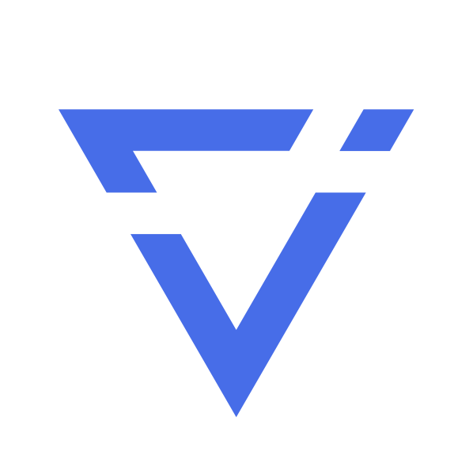

  

<h1 align="center">iconLake</h1>

  <a href="https://iconlake.com" target="_blank">官网（https://iconlake.com）</a>
  | <a href="./documents/sponsor/README.md">赞助</a>

# iconLake

iconLake - You Create, You Own!

## 目标

构建web3.0时代的创作全生命周期管理工具。

## 初心与使命

iconLake的初心是为创作者服务，我们希望每一位创作者的每一件作品都能够得到尊重和保护，并且能够以每一位创作者独有的气质来展览他们的作品。

## iconLake对“我”的价值

### “我”是创作者

1. iconLake可以帮助我分门别类地归档我的所有创作；
2. iconLake可以保护我的原创作品的版权，确保我的作品能够让我赚到钱；
3. iconLake可以为我提供个性化的作品展览；

### “我”是用户

1. iconLake可以让我欣赏到大量优质原创作品；
2. iconLake可以让我拥有我喜欢的作品；

### “我”是开发者

1. 我可以通过iconLake为创作者开发个性化的主题来赚钱；
2. 我可以通过参与iconLake的建设来赚取奖励，成为iconLake的“股东”；

## iconLake需要你

iconLake是一个去中心化的项目，我们也在致力于用去中心化的方式来打造这个项目，所以iconLake需要你。

我相信大家或多或少都感受到了互联网行业的就业压力，不论大公司还是小公司，都往社会上输送了大量人才，
如此多的有空又有闲（不论主动还是被动）的人才必然会催生出大量的新项目，这些新的项目就是下一次大爆发的有生力量，iconLake也是其中之一。

如果你不想错过这个一生都可遇而不可求的机会，那就赶紧脱掉鞋下河里来吧，别在岸上观望了，要抓大鱼就趁现在了。

你为iconLake做的贡献，都会通过区块链来进行确权，你所获得的不仅仅是数字，更是资产。

让我们一起参与iconLake这个“无限游戏”，为iconLake注入无限可能！

无论你是开发工程师、设计师、产品经理、运营、运维、测试、用户…… iconLake需要你。

  

加微信，邀你进群“iconLake Future Builders”。

## 问与答

### iconLake是如何做到对原创作品的保护的？

iconLake基于区块链技术以去中心化的方式把每一件作品保存在链上，信息不可篡改、作品可验证、创作者对自己的作品拥有所有权。

### 什么是LAKE？

LAKE是通过区块链技术确权的，用于记录为iconLake的发展做出贡献的参与方，所获得的可用于分享收益的凭证。

### 什么是DROP？

DROP是为了让信息保存到链上所需支付的费用，但是这个费用并不需要花钱，而是你的账户开启DROP的积累后，每一秒积累1udrop（1DROP=10000udrop），超过60DROP将停止积累，需要把已积累的DROP确认上链，然后重新开始下一轮积累，这样你将拥有源源不断的DROP来支付上链的费用。

## 贡献

### 方式

1. 提bug、意见、建议、想法等，参与产品塑造；（[Gitee](https://gitee.com/iconLake/IconLake/issues)）
2. 提交代码、设计稿、测试用例等，参与开发；
3. 发布有关iconLake的内容，参与运营推广；
4. 贡献方式不限于以上三类，只要能够对iconLake的发展起到积极作用均可获得认可。

### 激励

所有的有效贡献都将获得相应的回报，每一份贡献都将由专门的贡献价值评估小组来公平地为其赋予相应的LAKE，评估完成后所获LAKE都将实时发送到你的iconLake链上账户里。

## 赞助

感谢您考虑为iconLake项目提供赞助支持！您的每一份贡献都将帮助我们建设一个更好的创作者生态系统。更多详情请参考[赞助指南](./documents/sponsor/README.md)。
