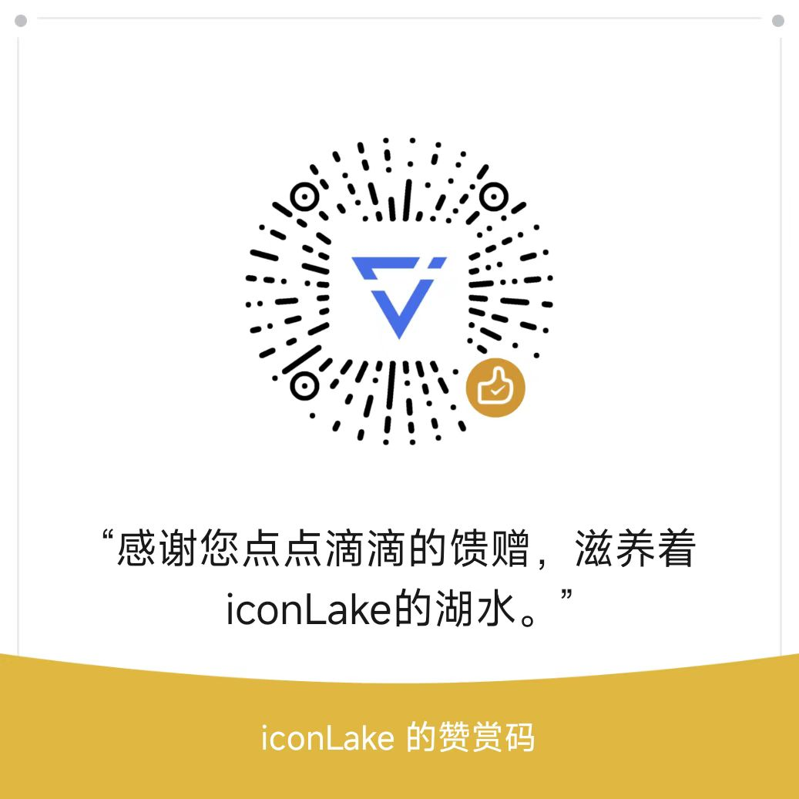

# iconLake Sponsorship Guide

Thank you for considering sponsoring the iconLake project! Your contribution will help us build a better ecosystem for creators.

## Why We Need Sponsorship

iconLake is a completely open-source decentralized project dedicated to providing comprehensive support for creators in the web3.0 era. To continue advancing the project, we need to:

- Maintain and upgrade infrastructure
- Develop new features
- Provide community operation support
- Organize creator events and workshops
- Improve user experience
- Ensure system security

Your sponsorship will directly support these important initiatives, helping iconLake provide better services to creators.

## How Sponsorship Funds Are Used

We commit to using sponsorship funds for:

1. Technical Development (50%)
   - Core feature development
   - Performance optimization
   - Security enhancement
   - Technical innovation research

2. Community Building (20%)
   - Community event organization
   - Creator support programs
   - Educational resource development
   - Community operation maintenance

3. Infrastructure (20%)
   - Server maintenance
   - Storage system upgrades
   - Network bandwidth support

4. Marketing (10%)
   - Brand building
   - User education
   - Community promotion
   - Industry partnerships

## Sponsorship Methods

We accept the following forms of sponsorship:

### Cryptocurrency

- Cosmos: `cosmos173fjcta5rfgyn5zvsw6wuzpp3jk7ffn4s0f0wq`
- BTC: `bc1plrq63v9c30t7s2g32nc3cnhkzh84l8djrh6xu939yhthj9gurm7qam6teg`
- ETH: `0x5681ca33505169A678f45b368a1ED4a4101ECE9B`
- USDT/USDC: `0x5681ca33505169A678f45b368a1ED4a4101ECE9B`

### Traditional Payment Methods

- Online payment (bank transfer, credit card, PayPal): <https://opencollective.com/iconlake>
- WeChat Pay
   

     
   

- Alipay
   

     
   

## Sponsor Privileges

To thank our sponsors for their support, we offer the following privileges:

### Bronze Supporter (≥ ¥10)

- Exclusive badge display

### Silver Supporter (≥ ¥200)

- Includes Bronze privileges
- Access to project daily updates
- Priority access to new features
- Exclusive technical support channel
- Priority participation in community events

### Gold Supporter (≥ ¥1000)

- Includes Silver privileges
- Priority development of custom themes
- Voting rights on major project decisions
- Invitation to annual contributor offline events

### Diamond Supporter (≥ ¥10000)

- Includes Gold privileges
- Project advisory board membership
- Priority for exclusive feature requests
- Participation in project strategy meetings
- Customized technical support services

## Special Notes

1. All sponsorships are voluntary and do not constitute any form of investment.
2. Sponsor privileges are valid for one year (calculated from the date of sponsorship).
3. The project commits to regularly publishing reports on the use of sponsorship funds.

## Thanking Our Sponsors

We deeply appreciate every sponsor who supports iconLake's development. Your generous support is a crucial force driving the project forward. We will:

- Establish a sponsor honor wall on the project website
- Periodically host exclusive events for sponsors
- Provide personalized support services for sponsors

Each of your contributions will be permanently recorded on the blockchain, becoming an indelible part of iconLake's development journey.

## Contact Us

If you have any questions about sponsorship, please contact us through the following channels:

- WeChat: iconLake

  

Thank you again for your support of iconLake!
