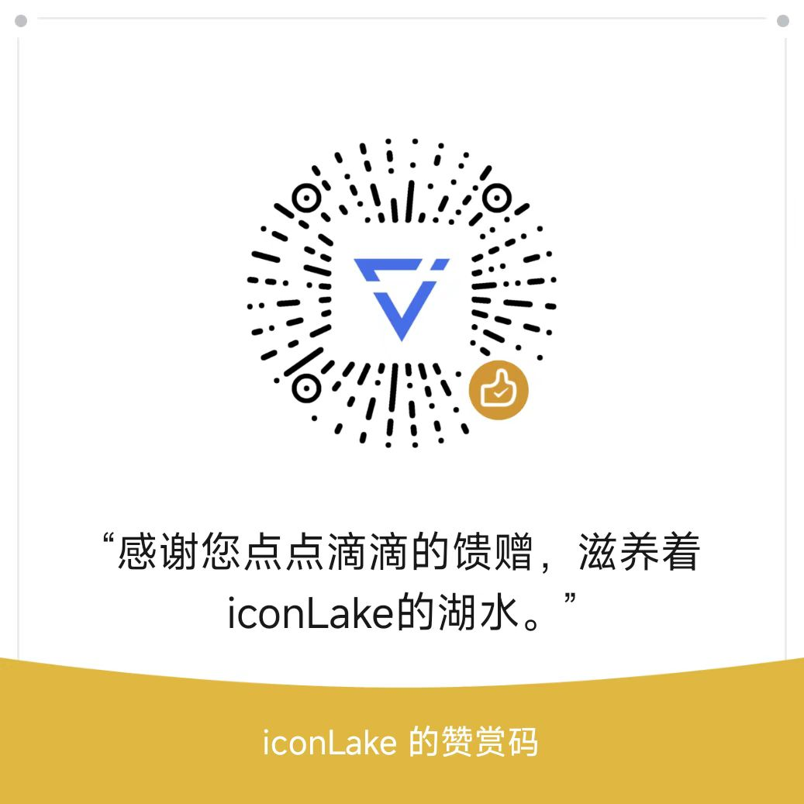

# iconLake 赞助指南

感谢您考虑为iconLake项目提供赞助支持！您的每一份贡献都将帮助我们建设一个更好的创作者生态系统。

## 为什么需要赞助？

iconLake是一个完全开源的去中心化项目，我们致力于为web3.0时代的创作者提供全方位的支持。为了持续推进项目发展，我们需要：

- 维护和升级基础设施
- 持续研发新功能
- 提供社区运营支持
- 举办创作者活动和工作坊
- 改进用户体验
- 确保系统安全性

您的赞助将直接用于支持这些重要工作，帮助iconLake为创作者提供更好的服务。

## 赞助的用途

我们承诺将赞助资金用于：

1. 技术开发（50%）
   - 核心功能开发
   - 性能优化
   - 安全加固
   - 技术创新研究

2. 社区建设（20%）
   - 社区活动组织
   - 创作者支持计划
   - 教育资源开发
   - 社区运营维护

3. 基础设施（20%）
   - 服务器维护
   - 存储系统升级
   - 网络带宽支持

4. 市场推广（10%）
   - 品牌建设
   - 用户教育
   - 社区推广
   - 行业合作

## 赞助方式

我们接受以下形式的赞助：

### 加密货币

- Cosmos: `cosmos173fjcta5rfgyn5zvsw6wuzpp3jk7ffn4s0f0wq`
- BTC: `bc1plrq63v9c30t7s2g32nc3cnhkzh84l8djrh6xu939yhthj9gurm7qam6teg`
- ETH: `0x5681ca33505169A678f45b368a1ED4a4101ECE9B`
- USDT/USDC: `0x5681ca33505169A678f45b368a1ED4a4101ECE9B`

### 传统支付

- 在线支付（银行转账、信用卡支付、PayPal）: <https://opencollective.com/iconLake>
- 微信支付
   

     
   

- 支付宝
   

     
   

## 赞助者特权

为感谢赞助者的支持，我们提供以下特权：

### 青铜支持者 (≥ ¥10)

- 专属徽章显示
- 赞助者荣誉墙展示

### 白银支持者 (≥ ¥200)

- 包含青铜特权
- 查看项目日常动态
- 优先体验新功能
- 专属技术支持渠道
- 社区活动优先参与权

### 黄金支持者 (≥ ¥1000)

- 包含白银特权
- 定制主题优先开发
- 项目重大决策投票权
- 年度贡献者线下活动邀请

### 钻石支持者 (≥ ¥10000)

- 包含黄金特权
- 项目顾问委员会成员资格
- 专属功能需求优先级
- 项目战略会议参与权
- 定制化技术支持服务

## 特别说明

1. 所有赞助都是自愿的，不构成任何形式的投资。
2. 赞助者特权有效期为一年（从赞助之日起计算）。
3. 项目承诺定期公布赞助使用情况报告。

## 感谢赞助者

我们深深感谢每一位支持iconLake发展的赞助者。您的慷慨支持是推动项目前进的重要力量。我们将：

- 在项目官网设立赞助者荣誉墙
- 不定期举办赞助者专属活动
- 为赞助者提供个性化支持服务

您的每一份贡献都将被永久记录在区块链上，成为iconLake发展历程中不可磨灭的一部分。

## 联系我们

如果您有任何关于赞助的问题，请通过以下方式联系我们：

- 微信：iconlake

  

再次感谢您对iconLake的支持！
